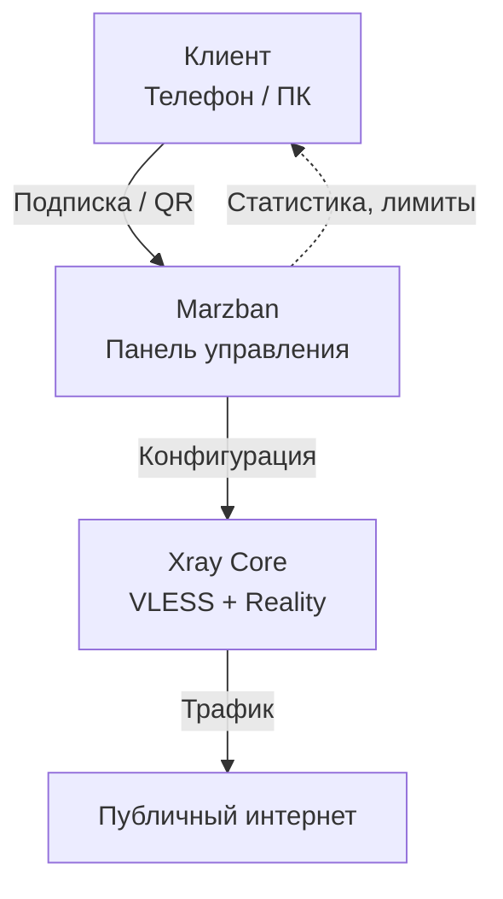
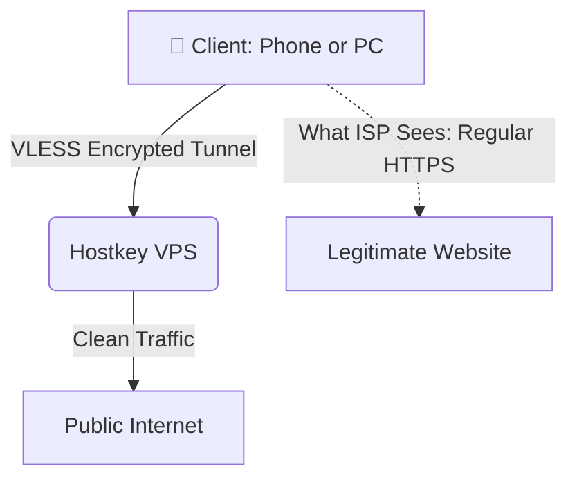

<div align="center">
  
</div>


<div align="center">

[](LICENSE)
[](https://github.com/Gozargah/Marzban)
[](https://github.com/XTLS/Xray-core)
[](https://www.docker.com/)

</div>

<div align="center">
  <svg width="100%" height="160" viewBox="0 0 800 160" xmlns="http://www.w3.org/2000/svg">
    <defs>
      <linearGradient id="marzGrad" x1="0" y1="0" x2="1" y2="1">
        <stop offset="0%" stop-color="#3b82f6"/>
        <stop offset="100%" stop-color="#06b6d4"/>
      </linearGradient>
      <filter id="marzGlow">
        <feGaussianBlur stdDeviation="2.5" result="coloredBlur"/>
        <feMerge>
          <feMergeNode in="coloredBlur"/>
          <feMergeNode in="SourceGraphic"/>
        </feMerge>
      </filter>
    </defs>

    <!-- Фон-полоса -->
    <rect x="0" y="0" width="800" height="160" fill="#0d1117" opacity="0"/>

    <!-- Сетка -->
    <g stroke="#1f2937" stroke-width="1" opacity="0.4">
      <path d="M0 40 L800 40"/>
      <path d="M0 80 L800 80"/>
      <path d="M0 120 L800 120"/>
      <path d="M100 0 L100 160"/>
      <path d="M200 0 L200 160"/>
      <path d="M300 0 L300 160"/>
      <path d="M400 0 L400 160"/>
      <path d="M500 0 L500 160"/>
      <path d="M600 0 L600 160"/>
      <path d="M700 0 L700 160"/>
    </g>

    <!-- Анимированные «волны» панели -->
    <g fill="url(#marzGrad)" opacity="0.15" filter="url(#marzGlow)">
      <circle cx="200" cy="80" r="40">
        <animate attributeName="r" values="30;45;30" dur="4s" repeatCount="indefinite"/>
        <animate attributeName="opacity" values="0.1;0.2;0.1" dur="4s" repeatCount="indefinite"/>
      </circle>
      <circle cx="400" cy="80" r="50">
        <animate attributeName="r" values="40;60;40" dur="5s" repeatCount="indefinite"/>
        <animate attributeName="opacity" values="0.1;0.25;0.1" dur="5s" repeatCount="indefinite"/>
      </circle>
      <circle cx="600" cy="80" r="35">
        <animate attributeName="r" values="25;40;25" dur="4.5s" repeatCount="indefinite"/>
        <animate attributeName="opacity" values="0.1;0.2;0.1" dur="4.5s" repeatCount="indefinite"/>
      </circle>
    </g>

    <!-- Иконка «панель» -->
    <g transform="translate(340,50)" fill="none" stroke="url(#marzGrad)" stroke-width="2" filter="url(#marzGlow)">
      <rect x="0" y="0" width="120" height="60" rx="8"/>
      <path d="M20 20 L100 20"/>
      <path d="M20 35 L70 35"/>
      <path d="M20 50 L80 50"/>
      <circle cx="95" cy="50" r="3" fill="url(#marzGrad)"/>
    </g>

    <!-- Подпись -->
    <text x="400" y="135" font-family="Segoe UI, Roboto, Arial" font-size="16" fill="#93c5fd" text-anchor="middle" opacity="0.9">
      Marzban + Xray Core
    </text>
  </svg>
</div>

## 🖥️ Панель управления: Marzban

Раньше я использовал 3x-ui, но после того как на эту панель посыпалось много хейта от более опытных ребят, я решил разобраться и попробовать альтернативы. В итоге остановился на **Marzban** — это современная панель на базе Xray Core, которая разворачивается через Docker. Она даёт гораздо больше контроля над пользователями, трафиком и настройками, при этом остаётся достаточно понятной. [6][7][11][17][22][24][26][27][31]

### Почему я выбрал Marzban

- **Многопользовательский режим.** Можно создавать отдельных пользователей с личными лимитами трафика и сроком действия. Для меня это важно, потому что я уже думаю не только о себе, но и о друзьях, которые тоже хотят подключиться. [6][7][11][17][26]
- **Подписки и QR-коды.** Для каждого пользователя генерируется уникальная ссылка-подписка и QR-код. Это сильно упрощает подключение: человек просто сканирует код или вставляет ссылку в клиент. [6][11][17][24][25][26][27]
- **Мониторинг.** В панели есть встроенная статистика: видно, сколько трафика использовал каждый пользователь, когда истекает его доступ и кто сейчас онлайн. [6][7][11][17][26]
- **API и интеграции.** У Marzban есть REST API и CLI, так что в будущем можно прикрутить биллинг, сайт, Telegram-бота или ещё какие-то свои фишки. [6][7][11][27][32]
- **Масштабируемость.** Если захочется поднять не один сервер, а несколько, их можно объединить под одной панелью (multi-node). [6][7][11][17][26][27][31]
- **Современный стек.** Marzban работает на Python + Docker + Xray Core. Для комфортной работы желательно иметь хотя бы 1 GB RAM на сервере. [5][6][7][11][17][24][26][27]

### Как работает Marzban (упрощённо)



### Как я устанавливал Marzban

> [!NOTE]
> Полную пошаговую инструкцию я позже вынесу в отдельный гайд: [guide/marzban-setup.md](guide/marzban-setup.md).

1. **Подготовка сервера**

   На чистом Ubuntu/Debian я сначала обновил систему и поставил curl:

   ```bash
   sudo apt update && sudo apt upgrade -y
   sudo apt install -y curl
   ```

2. **Установка Marzban**

   Дальше я использовал официальный скрипт установки (по умолчанию ставится SQLite):

   ```bash
   sudo bash -c "$(curl -sL https://github.com/Gozargah/Marzban-scripts/raw/master/marzban.sh)" @ install
   ```

   Если нужно, можно сразу выбрать другую базу данных:

   ```bash
   # MySQL
   sudo bash -c "$(curl -sL https://github.com/Gozargah/Marzban-scripts/raw/master/marzban.sh)" @ install --database mysql

   # MariaDB
   sudo bash -c "$(curl -sL https://github.com/Gozargah/Marzban-scripts/raw/master/marzban.sh)" @ install --database mariadb
   ```

3. **Создание администратора**

   После установки я создал первого админа:

   ```bash
   sudo marzban cli admin create --sudo
   ```

   Скрипт попросил ввести логин и пароль — именно они используются для входа в веб-панель. [23][24][26]

4. **Доступ к веб-панели**

   По умолчанию панель открывается по адресу:

   ```text
   http://YOUR_SERVER_IP:8000
   ```

   Я просто вбил этот адрес в браузере и залогинился с данными, которые создал на прошлом шаге. [24][26][27]

### Настройка VLESS + Reality

1. **Генерация ключей Reality**

   Чтобы настроить Reality, сначала нужно сгенерировать ключи. Я выполнил на сервере:

   ```bash
   docker exec marzban-marzban-1 xray x25519
   ```

   В ответ получил `PrivateKey` и `PublicKey` — они понадобятся при создании инбаунда. [20][23][28][29]

2. **Создание инбаунда**

   В веб-панели я зашёл в **Core Settings / Inbounds** и добавил новый inbound:

   - протокол: `VLESS`
   - транспорт: `TCP`
   - безопасность: `Reality`

   В конфиг вставил `PrivateKey`, указал `dest` и `serverNames` (например, `cloudflare.com:443`), задал `shortIds`.

   Пример конфига (упрощённо):

   ```json
   {
     "tag": "VLESS_TCP_REALITY",
     "listen": "0.0.0.0",
     "port": 443,
     "protocol": "vless",
     "settings": {
       "clients": [],
       "decryption": "none"
     },
     "streamSettings": {
       "network": "tcp",
       "security": "reality",
       "realitySettings": {
         "show": false,
         "dest": "cloudflare.com:443",
         "xver": 0,
         "serverNames": ["cloudflare.com"],
         "privateKey": "<PRIVATE_KEY>",
         "shortIds": ["<SHORT_ID>"]
       }
     },
     "sniffing": {
       "enabled": true,
       "destOverride": ["http", "tls", "quic"]
     }
   }
   ```

   [19][20][23][24][25][28][29]

3. **Создание пользователей**

   В разделе **Users** я нажал **Add User** и для каждого клиента указал:

   - username;
   - лимит трафика (по желанию);
   - срок действия (по желанию);
   - выбранный inbound `VLESS_TCP_REALITY`.

   После сохранения для пользователя автоматически появились ссылка-подписка и QR-код. [6][11][17][24][25][26][27]

4. **Подключение клиентов**

   На телефоне и ПК я просто:

   - отсканировал QR-код;
   - либо скопировал subscription URL и импортировал его в клиенте (v2rayNG, Hiddify, Nekobox, Streisand и т.п.).

   После этого включил прокси и проверил, что всё работает. [19][21][24][25]

> [!TIP]
> Для безопасности я также рекомендую:
> - сменить стандартный порт панели (`8000`) на другой;
> - ограничить доступ к порту через firewall;
> - если есть домен — настроить HTTPS (nginx + TLS) перед панелью. [22][27]


# 🌐 Self-Hosted VPN Server: My 15-Year-Old Journey into Networking & Security

[](https://opensource.org)
[](https://linux.org)

🌐 [English](README.md) | [Русский](README.ru.md)

Hello everyone! I’m a 15‑year‑old school student who is interested in computer networks, cybersecurity, and programming. Due to serious limitations and the lack of security in how the internet works, I decided to create this repository, in which I will provide a very detailed account of how to build your own VPN server from scratch.

> [!NOTE]
> ### 🗺️ Repository Navigation / Repository Guide
> This project has been translated into two languages and divided into logical blocks for easy learning:
>
> * 🌐 **[README.md](README.md)** — A brief description of the project, technology stack, and goals in English.
> * 🇷🇺 **[README.ru.md](README.ru.md)** — The same main description, but in Russian.
> * 📁 **[guide](guide/)** — Super clear guides on how to fully create your own VPN server.

> [!CAUTION]
> ### 🚨 IMPORTANT!!!
> If you have any questions, suggestions, or encounter any errors, please be sure to message me privately. I’ll be happy to try to help you!!!

## 🛠️ Tech Stack & Tools
* **OS:** Ubuntu Server / Debian
* **Protocol:** VLESS + Reality (via Xray Core)
* **Security:** SSH Keys, Custom Ports, Automated network switching to bypass IP address blocking.
* **Infrastructure:** Remote VPS (Virtual Private Server)
* **Management:** 3x-ui Web Panel

## 💡 Why Self-Hosted?
* **Privacy:** Full control over my own data with a strict no-logs policy.
* **Performance:** No speed throttling compared to free public VPN services.
* **Education:** The best way to understand the OSI model, routing, and Linux administration is to build it yourself.

## 📐 Network Architecture
Here is how the network traffic flows and tricks network filters using Reality obfuscation:



### How it works under the hood:
1. **Masking:** Instead of buying a TLS certificate, Reality "borrows" one from a major website. To your ISP, it looks like you are just visiting an official, unblocked platform.
2. **Routing:** The Hostkey VPS intercepts the connection, decrypts the VLESS packet, and forwards your actual request to the destination website.
3. **Privacy:** Your home IP address stays completely hidden from the internet, and your traffic remains immune to standard VPN blocking techniques.

## 🚀 Step-by-Step Installation & Configuration

Here is exactly how I deployed my server, secured it, and set up the next-generation VLESS+Reality protocol using the 3x-ui panel.

### 🏠 Step 1: VPS Procurement & Initial Server Setup
1. **Hosting Choice:** I ordered a Virtual Private Server (VPS) hosted by **Hostkey** for roughly 490 RUB/month.

> [!NOTE]
> **There is a very wide selection of hosting services (which may even be cheaper), for example:**

> **1. https://xorek.cloud — a good alternative, slightly cheaper**

> **2. https://play2go.cloud/ — also a good gaming server hosting service**

> **3. https://my.u1host.com — a time‑tested hosting service**


3. **First Security Step:** Immediately after the server was deployed, I changed the default root password to a strong, randomly generated one to prevent brute-force attacks.
4. **System Update:** I connected to the server via SSH and updated the system packages to ensure all security patches were installed:
   ```bash
   sudo apt update && sudo apt upgrade -y && reboot
   ```

### 🛠️ Step 2: Installing and Configuring the 3x-ui Panel
Instead of managing raw configuration files, I deployed **3x-ui**, a powerful web panel for managing Xray/VLESS proxies.

1. **Installation:** I executed the 3x-ui installation script via the terminal.
2. **Credential Management:** Upon successful installation, the script provided a local IP address, port, and default credentials. I securely saved this information.
3. **Web Panel Access:** I accessed the dashboard via my browser and immediately updated the default admin username and password for security.

### 🔒 Step 3: Setting Up the VLESS-Reality Inbound
To bypass strict network DPI (Deep Packet Inspection) filters, I chose the modern **VLESS protocol with Reality obfuscation**.

* **Port:** `51820`
* **Protocol:** `VLESS`
* **Transmission:** `TCP`
* **Security:** `Reality`

> [!NOTE]
> **Why Reality?** Reality eliminates the need for purchasing TLS certificates. Instead, it "borrows" a certificate from a legitimate, unblocked website (like `google.com` or `microsoft.com`), making my VPN traffic look completely identical to standard HTTPS web browsing.

### 👥 Step 4: Client Management & Access Control
Inside the 3x-ui panel, I created client profiles. The panel automatically generated individual configuration links and QR codes. I configured the client settings with specific bandwidth permissions and successfully connected my personal phone and PC using the **v2rayN / Nekobox / Shadowrocket** client apps.

## ⚠️ Challenges & Cross-Platform Client Selection

During the deployment, I didn't experience any issues with the server-side setup or hosting procurement. However, the main challenge was finding the right cross-platform client software to connect my devices, especially for **Linux** and **iOS**, where reliable and secure options are extremely limited.

### 🔍 The Client Selection Challenge
* **The Problem:** Many popular Xray/VLESS clients are either platform-specific, lack a modern graphical interface, or have stability issues. For Linux, the selection of GUI clients is notoriously small and often requires complex terminal configurations. For iOS, many apps are filled with ads or fail to maintain a stable background connection.
* **The Discovery & Solution:** After testing multiple applications, I discovered **Happ (Proxy Utility)**. It turned out to be the absolute ideal and safest choice for my entire ecosystem (Windows, Linux, and iPhone):
  1. **Linux Integration:** Happ provides a seamless, secure GUI experience on Linux, which solved the "small choice" dilemma without breaking system routing tables.
  2. **iOS Stability:** On the iPhone, it proved to be incredibly power-efficient, securely handling the VLESS+Reality protocol natively via the Xray core without unexpected drops.
  3. **Flawless Configuration & QR Scanning:** The connection process was incredibly simple. I just generated the client profile inside the 3x-ui panel, scanned the QR code with the Happ app, and the entire complex VLESS+Reality configuration was imported instantly without any manual typing.
  4. **Unified Ecosystem:** Using Happ across Windows, Linux, and iOS allowed me to maintain identical split-tunneling and routing rules on all my personal devices.

---

## 📈 Conclusion

Building this project was an amazing practical experience. Instead of just reading theory, setting up this server from scratch helped me deeply understand how remote Linux servers operate, how internet routing works, and how next-generation encryption protocols protect our data. 

Now I have my own reliable, high-speed infrastructure that I use every day across all my personal devices.

---
*Feel free to star ⭐ this repository if you found this guide helpful!*
