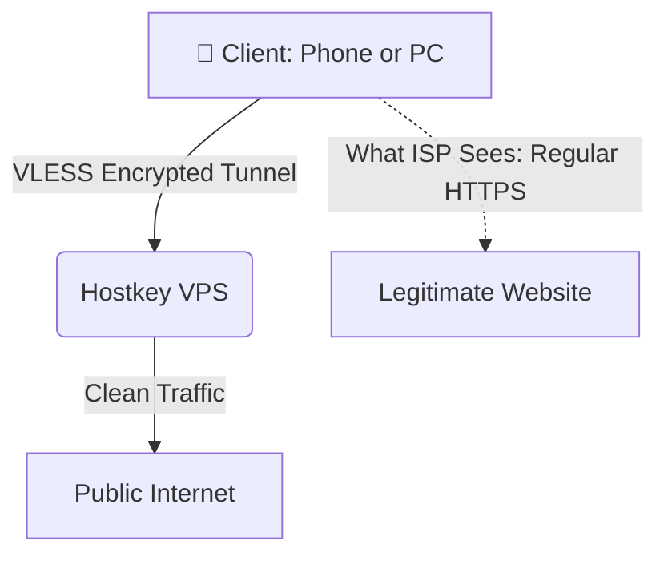

# 🌐 Self-Hosted VPN Server: My 15-Year-Old Journey into Networking & Security

[](https://opensource.org)
[](https://linux.org)

🌐 [English](README.md) | [Русский](README.ru.md)

Hello everyone! I’m a 15‑year‑old school student who is interested in computer networks, cybersecurity, and programming. Due to serious limitations and the lack of security in how the internet works, I decided to create this repository, in which I will provide a very detailed account of how to build your own VPN server from scratch.
---

## 🛠️ Tech Stack & Tools
* **OS:** Ubuntu Server / Debian
* **Protocol:** VLESS + Reality (via Xray Core)
* **Security:** SSH Keys, Custom Ports, Automated network switching to bypass IP address blocking.
* **Infrastructure:** Remote VPS (Virtual Private Server)
* **Management:** 3x-ui Web Panel

## 💡 Why Self-Hosted?
* **Privacy:** Full control over my own data with a strict no-logs policy.
* **Performance:** No speed throttling compared to free public VPN services.
* **Education:** The best way to understand the OSI model, routing, and Linux administration is to build it yourself.

## 📐 Network Architecture
Here is how the network traffic flows and tricks network filters using Reality obfuscation:



### How it works under the hood:
1. **Masking:** Instead of buying a TLS certificate, Reality "borrows" one from a major website. To your ISP, it looks like you are just visiting an official, unblocked platform.
2. **Routing:** The Hostkey VPS intercepts the connection, decrypts the VLESS packet, and forwards your actual request to the destination website.
3. **Privacy:** Your home IP address stays completely hidden from the internet, and your traffic remains immune to standard VPN blocking techniques.

## 🚀 Step-by-Step Installation & Configuration

Here is exactly how I deployed my server, secured it, and set up the next-generation VLESS+Reality protocol using the 3x-ui panel.

### 🏠 Step 1: VPS Procurement & Initial Server Setup
1. **Hosting Choice:** I ordered a Virtual Private Server (VPS) hosted by **Hostkey** for roughly 490 RUB/month.
2. **First Security Step:** Immediately after the server was deployed, I changed the default root password to a strong, randomly generated one to prevent brute-force attacks.
3. **System Update:** I connected to the server via SSH and updated the system packages to ensure all security patches were installed:
   ```bash
   sudo apt update && sudo apt upgrade -y && reboot
   ```

### 🛠️ Step 2: Installing and Configuring the 3x-ui Panel
Instead of managing raw configuration files, I deployed **3x-ui**, a powerful web panel for managing Xray/VLESS proxies.

1. **Installation:** I executed the 3x-ui installation script via the terminal.
2. **Credential Management:** Upon successful installation, the script provided a local IP address, port, and default credentials. I securely saved this information.
3. **Web Panel Access:** I accessed the dashboard via my browser and immediately updated the default admin username and password for security.

### 🔒 Step 3: Setting Up the VLESS-Reality Inbound
To bypass strict network DPI (Deep Packet Inspection) filters, I chose the modern **VLESS protocol with Reality obfuscation**.

* **Port:** `51820`
* **Protocol:** `VLESS`
* **Transmission:** `TCP`
* **Security:** `Reality`

> [!NOTE]
> **Why Reality?** Reality eliminates the need for purchasing TLS certificates. Instead, it "borrows" a certificate from a legitimate, unblocked website (like `google.com` or `microsoft.com`), making my VPN traffic look completely identical to standard HTTPS web browsing.

### 👥 Step 4: Client Management & Access Control
Inside the 3x-ui panel, I created client profiles. The panel automatically generated individual configuration links and QR codes. I configured the client settings with specific bandwidth permissions and successfully connected my personal phone and PC using the **v2rayN / Nekobox / Shadowrocket** client apps.

## ⚠️ Challenges & Cross-Platform Client Selection

During the deployment, I didn't experience any issues with the server-side setup or hosting procurement. However, the main challenge was finding the right cross-platform client software to connect my devices, especially for **Linux** and **iOS**, where reliable and secure options are extremely limited.

### 🔍 The Client Selection Challenge
* **The Problem:** Many popular Xray/VLESS clients are either platform-specific, lack a modern graphical interface, or have stability issues. For Linux, the selection of GUI clients is notoriously small and often requires complex terminal configurations. For iOS, many apps are filled with ads or fail to maintain a stable background connection.
* **The Discovery & Solution:** After testing multiple applications, I discovered **Happ (Proxy Utility)**. It turned out to be the absolute ideal and safest choice for my entire ecosystem (Windows, Linux, and iPhone):
  1. **Linux Integration:** Happ provides a seamless, secure GUI experience on Linux, which solved the "small choice" dilemma without breaking system routing tables.
  2. **iOS Stability:** On the iPhone, it proved to be incredibly power-efficient, securely handling the VLESS+Reality protocol natively via the Xray core without unexpected drops.
  3. **Flawless Configuration & QR Scanning:** The connection process was incredibly simple. I just generated the client profile inside the 3x-ui panel, scanned the QR code with the Happ app, and the entire complex VLESS+Reality configuration was imported instantly without any manual typing.
  4. **Unified Ecosystem:** Using Happ across Windows, Linux, and iOS allowed me to maintain identical split-tunneling and routing rules on all my personal devices.

---

## 📈 Conclusion

Building this project was an amazing practical experience. Instead of just reading theory, setting up this server from scratch helped me deeply understand how remote Linux servers operate, how internet routing works, and how next-generation encryption protocols protect our data. 

Now I have my own reliable, high-speed infrastructure that I use every day across all my personal devices.

---
*Feel free to star ⭐ this repository if you found this guide helpful!*
