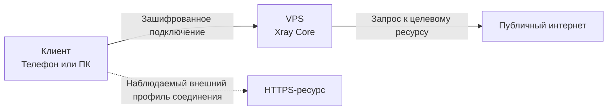

<div align="center">
  
</div>

<div align="center">

[](LICENSE)
[](https://www.linux.org/)
[](https://github.com/XTLS/Xray-core)
[](https://github.com/MHSanaei/3x-ui)

[English](README.md) · [Русский](README.ru.md) · [Гайды](guide/)

</div>

# Собственный VPN-сервер: мой путь в сети и кибербезопасность в 15 лет

Привет! Я 15-летний школьник, который увлекается компьютерными сетями, кибербезопасностью и программированием. Из-за ограничений, нестабильности и рисков при работе в интернете я решил собрать собственную инфраструктуру и подробно задокументировать весь путь в этом репозитории.

Здесь я рассказываю, как развернуть личный VPN-сервер с нуля: от выбора VPS и базовой защиты Linux до настройки VLESS + Reality, управления клиентами и подключения устройств.

> [!NOTE]
> ## Навигация по репозиторию
>
> Проект доступен на двух языках и разделён на отдельные логические части:
>
> - [README.md](README.md) — краткое описание проекта, технологий и целей на английском языке.
> - [README.ru.md](README.ru.md) — основное описание проекта на русском языке.
> - [guide/](guide/) — пошаговые инструкции по созданию и настройке собственного VPN-сервера.

> [!CAUTION]
> ## Важно
>
> Этот репозиторий создан в образовательных целях и для самостоятельного развертывания личной инфраструктуры. Используйте сервер, программное обеспечение и сетевые инструменты законно, с учётом правил вашего хостинга и требований законодательства.
>
> Если у вас есть вопрос, предложение или вы заметили ошибку, напишите мне в личные сообщения — постараюсь помочь.

## Технологический стек

- **ОС:** Ubuntu Server / Debian
- **Протокол:** VLESS + Reality на базе Xray Core
- **Безопасность:** SSH-ключи, нестандартные порты, обновления системы и базовое усиление защиты сервера
- **Инфраструктура:** VPS — виртуальный приватный сервер
- **Управление:** веб-панель 3x-ui

## Почему собственный сервер

- **Приватность.** Ты самостоятельно выбираешь хостинг, настраиваешь доступ и контролируешь свою инфраструктуру.
- **Производительность.** Нет искусственных ограничений, характерных для многих бесплатных публичных сервисов; реальная скорость зависит от VPS, канала и маршрута.
- **Обучение.** Практическая настройка помогает разобраться в Linux, SSH, DNS, маршрутизации, модели OSI и сетевой безопасности.

## Архитектура сети

Ниже показано упрощённое движение трафика при подключении через VPS и VLESS + Reality:



### Как это работает

1. **Подключение.** Клиент устанавливает зашифрованное соединение с твоим VPS, где работает Xray Core.
2. **Маскировка Reality.** Reality использует параметры выбранного TLS-сайта для формирования соединения, похожего на обычный HTTPS-трафик. Это не является абсолютной гарантией обхода любых ограничений: результат зависит от сети, DPI-систем, конфигурации и актуальной ситуации.
3. **Маршрутизация.** VPS принимает соединение, обрабатывает трафик и передаёт запрос к целевому ресурсу.
4. **Конфиденциальность.** Внешний сайт видит IP-адрес VPS, а не домашний IP-адрес клиента. При этом хостинг и администратор сервера всё равно отвечают за защиту VPS и его конфигурации.

## Пошаговая установка и настройка

Ниже — общий путь, по которому я развернул сервер. Подробные команды и пояснения будут находиться в папке [guide/](guide/).

### Шаг 1. Выбор VPS и первичная настройка

1. **Выбор хостинга.** Я арендовал VPS у Hostkey примерно за 490 рублей в месяц.

> [!NOTE]
> Другие варианты хостингов, которые можно изучить и сравнить по цене, локации, правилам использования и характеристикам:
>
> - [xorek.cloud](https://xorek.cloud) — один из вариантов с более низкими ценами.
> - [play2go.cloud](https://play2go.cloud/) — хостинг, ориентированный в том числе на игровые серверы.
> - [my.u1host.com](https://my.u1host.com) — ещё один вариант для сравнения.

2. **Смена пароля и доступ по SSH.** Сразу после создания сервера я заменил стандартный пароль на длинный случайно сгенерированный. В дальнейшем лучше перейти на SSH-ключи и отключить вход по паролю после проверки доступа.

3. **Обновление системы.** После подключения по SSH я установил актуальные обновления и патчи безопасности:

```bash
sudo apt update && sudo apt upgrade -y
sudo reboot
```

### Шаг 2. Установка и настройка 3x-ui

1. **Установка.** Я установил панель 3x-ui через терминал.
2. **Учётные данные.** После установки панель предоставляет адрес, порт и данные для первоначального входа.
3. **Доступ к панели.** Я открыл веб-панель в браузере и сразу сменил стандартные данные администратора на уникальные.

> [!WARNING]
> Не оставляй панель управления доступной из интернета с начальными логином, паролем и портом. Ограничь доступ через firewall, VPN, IP allowlist или обратный прокси с дополнительной защитой.

### Шаг 3. Настройка входящего соединения VLESS + Reality

Для эксперимента с сетевой устойчивостью и маскировкой соединения я выбрал VLESS с Reality.

- **Порт:** `51820`
- **Протокол:** `VLESS`
- **Передача:** `TCP`
- **Безопасность:** `Reality`

> [!NOTE]
> **Почему Reality?** Эта технология позволяет использовать TLS-параметры выбранного сайта без необходимости выпускать собственный TLS-сертификат для входящего соединения. Её эффективность зависит от корректной настройки, выбранного назначения, версии Xray Core и особенностей конкретной сети.

### Шаг 4. Управление клиентами и доступом

В панели 3x-ui я создал отдельные профили клиентов. Для каждого профиля панель сгенерировала ссылку конфигурации и QR-код. После этого я импортировал конфигурации на телефоне и ПК через подходящие клиентские приложения.

Для безопасности стоит:

- создавать отдельную конфигурацию для каждого устройства;
- не передавать публично ссылки VLESS и QR-коды;
- вовремя отключать неиспользуемых клиентов;
- ограничивать трафик, срок действия или число IP-адресов, если сервер используется несколькими людьми;
- делать резервные копии конфигурации и хранить их вне сервера.

## Трудности и выбор клиента

Серверная часть и аренда VPS прошли без серьёзных проблем. Сложнее оказалось подобрать удобный кроссплатформенный клиент, особенно для Linux и iOS: часть программ ориентирована только на одну ОС, требует ручной настройки или работает нестабильно в отдельных сценариях.

После тестов я остановился на **Happ (Proxy Utility)** для личной экосистемы Windows, Linux и iPhone.

### Почему Happ

1. **Linux.** Графический интерфейс упрощает импорт конфигурации и управление подключением.
2. **iOS.** Приложение показало стабильную работу на моём устройстве и удобный импорт через QR-код.
3. **Быстрый старт.** Достаточно создать клиента в 3x-ui, отсканировать QR-код и проверить подключение.
4. **Единый подход.** Одна программа на нескольких платформах упрощает поддержку конфигураций и правил маршрутизации.

> [!TIP]
> Выбор клиента — индивидуальная часть настройки. Перед использованием проверь, поддерживает ли приложение VLESS + Reality, актуальные версии используемого ядра, импорт URI и нужные тебе правила маршрутизации.

## Заключение

Создание этого проекта стало для меня практическим опытом работы с удалёнными Linux-серверами, сетевыми протоколами, SSH-доступом, маршрутизацией и документацией.

Вместо изучения теории отдельно от практики я собрал собственную инфраструктуру, протестировал её на личных устройствах и оформил процесс так, чтобы он мог помочь другим людям разобраться в теме.

Если этот проект оказался полезен, буду рад звезде репозитория.
Теперь у меня есть собственная надежная и высокоскоростная инфраструктура, которую я каждый день использую на всех своих личных устройствах.

---
*Не стесняйтесь ставить ⭐ этому репозиторию, если этот гайд был вам полезен!*
