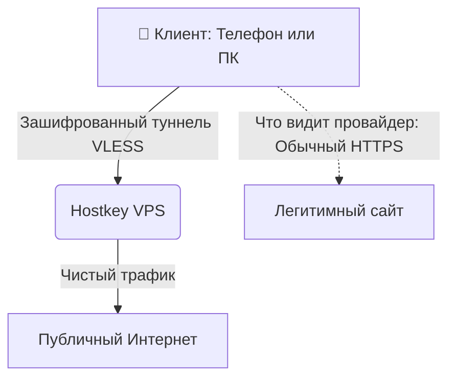

# 🌐 Собственный VPN-сервер: Мой путь в сети и кибербезопасность в 15 лет
<p align="center">
  
</p>

[](https://opensource.org)
[](https://linux.org)

🌐 [English](README.md) | [Русский](README.ru.md)

Всех приветствую! Я 15-летний школьник, который увлекается компьютерными сетями, кибербезопасностью и программированием. Из-за серьезных ограничений и небезопастности в работе интернета я решил создать этот репозиторий, в котором я очень подробно расскажу про создание собственного VPN-сервера с нуля.


> [!NOTE]
> ### 🗺️ Навигация по репозиторию / Repository Guide
> Этот проект переведен на два языка и разделен на логические блоки для удобного изучения:
>
> * 🌐 **[README.md](README.md)** — Краткое описание проекта, стек технологий и цели на английском языке.
> * 🇷🇺 **[README.ru.md](README.ru.md)** — То же самое главное описание, но на русском.
> * 📁 **[Папка docs/](docs/)** —  Супер понятные гайды по полному созданию собственного VPN сервера 
---
> [!CAUTION]
> ### 🚨 ВАЖНО!!!
> Если у вас возникли вопросы, предложения или какие-то оишбки, то обязательно напишите мне в личные сообщения, С радостью попробую вам помочь!!!
## 🛠️ Технологический стек и инструменты
* **ОС:** Ubuntu Server / Debian
* **Протокол:** VLESS + Reality (на базе Xray Core)
* **Безопасность:** SSH-ключи, кастомные порты, автоматическое переключение сети для обхода блокировок IP-адресов.
* **Инфраструктура:** Удаленный VPS (виртуальный приватный сервер)
* **Управление:** Веб-панель 3x-ui

## 💡 Почему собственный сервер?
* **Приватность:** Полный контроль над собственными данными.
* **Производительность:** Отсутствие искусственного ограничения скорости по сравнению с бесплатными публичными VPN-сервисами.
* **Обучение:** Лучший способ понять модель OSI, маршрутизацию и администрирование Linux — это собрать всё своими руками.

## 📐 Архитектура сети
Вот как движется сетевой трафик и обходит сетевые фильтры с помощью маскировки Reality:




### Как это работает под капотом:
1. **Маскировка:** Вместо покупки TLS-сертификата технология Reality «заимствует» его у крупного разрешенного сайта(к примеру google). Для вашего интернет-провайдера это выглядит так, будто вы просто зашли на официальную, неблокируемую платформу.
2. **Маршрутизация:** VPS-сервер Hostkey перехватывает соединение, расшифровывает пакет VLESS и пересылает ваш реальный запрос на целевой сайт.
3. **Конфиденциальность:** Ваш домашний IP-адрес остается полностью скрытым от интернета, а трафик становится устойчивым к стандартным методам блокировки VPN.

## 🚀 Пошаговая установка и настройка

Вот как именно я развернул свой сервер и настроил его: 

### 🏠 Шаг 1: Покупка VPS и первичная настройка сервера
1. **Выбор хостинга:** Я заказал виртуальный приватный сервер (VPS) у хостинга **Hostkey** примерно за 490 рублей в месяц.
2. **Первый шаг к безопасности:** Сразу после развертывания сервера я изменил дефолтный root-пароль на сложный, случайно сгенерированный, чтобы предотвратить атаки перебором.
3. **Обновление системы:** Я подключился к серверу по SSH и обновил системные пакеты, чтобы убедиться в установке всех патчей безопасности:
   ```bash
   sudo apt update && sudo apt upgrade -y && reboot
   ```

### 🛠️ Шаг 2: Установка и настройка панели 3x-ui

1. **Установка:** Я запустил скрипт установки 3x-ui через терминал.
2. **Управление данными:** После успешной установки скрипт выдал локальный IP-адрес, порт и стандартные данные для входа.
3. **Доступ к веб-панели:** Я зашел на панель управлением сервера через браузер, прописав данную информацию.

### 🔒 Шаг 3: Настройка входящего соединения VLESS-Reality
Чтобы обойти строгие фильтры DPI (глубокого анализа пакетов), я выбрал современный протокол **VLESS с обфускацией Reality**.

* **Порт:** `51820`
* **Протокол:** `VLESS`
* **Передача (Transmission):** `TCP`
* **Безопасность:** `Reality`

> [!NOTE]
> **Почему Reality?** Reality избавляет от необходимости покупать TLS-сертификаты. Вместо этого технология использует сертификат легитимного, незаблокированного сайта (например, `google.com` или поддомены Microsoft), делая мой VPN-трафик абсолютно идентичным обычному просмотру веб-страниц по HTTPS.

### 👥 Шаг 4: Управление клиентами и доступ
Внутри панели 3x-ui я создал профили клиентов. Панель автоматически сгенерировала индивидуальные ссылки для конфигурации и QR-коды. Я настроил параметры пользователей с определенными правами на пропускную способность и успешно подключил свой телефон и ПК через клиентские приложения.


## ⚠️ Трудности и выбор кроссплатформенного клиента

В процессе развертывания у меня не возникло никаких проблем с настройкой серверной части или покупкой хостинга. Однако главной задачей стал поиск правильного кроссплатформенного клиентского софта для подключения моих устройств — особенно для **Linux** и **iOS**, где выбор надежных и безопасных вариантов сильно ограничен.

### 🔍 Проблема выбора софта
* **Проблема:** Многие популярные клиенты Xray/VLESS заточены под конкретную ОС, не имеют графического интерфейса или работают нестабильно. Для Linux выбор GUI-клиентов крайне мал и часто требует сложной настройки через терминал. Для iOS многие приложения перегружены рекламой или постоянно вылетают в фоновом режиме.
* **Решение:** Протестировав несколько программ, я открыл для себя **Happ (Proxy Utility)**. Оно оказалось идеальным и самым безопасным выбором для всей моей экосистемы (Windows, Linux и iPhone):
  1. **Интеграция с Linux:** Happ обеспечивает плавный и безопасный графический интерфейс на Linux, что решило проблему дефицита софта без поломки системных таблиц маршрутизации.
  2. **Стабильность на iOS:** На iPhone приложение показало отличную энергоэффективность, стабильно удерживая протокол VLESS+Reality нативно через ядро Xray без неожиданных обрывов.
  3. **Простая конфигурация и сканирование QR:** Процесс подключения оказался невероятно простым. Я просто сгенерировал профиль клиента в панели 3x-ui, отсканировал QR-код через приложение Happ, и вся сложная конфигурация VLESS+Reality мгновенно импортировалась без ручного ввода.
  4. **Единая экосистема:** Использование Happ на Windows, Linux и iOS позволило мне сохранить идентичные правила раздельного туннелирования и маршрутизации на всех моих устройствах.

---

## 📈 Заключение

Создание этого проекта стало отличным практическим опытом. Вместо простого чтения теории, настройка сервера с нуля помогла мне глубоко понять, как работают удаленные серверы Linux, как устроена маршрутизация в интернете и как протоколы шифрования нового поколения защищают наши данные.

Теперь у меня есть собственная надежная и высокоскоростная инфраструктура, которую я каждый день использую на всех своих личных устройствах.

---
*Не стесняйтесь ставить ⭐ этому репозиторию, если этот гайд был вам полезен!*
