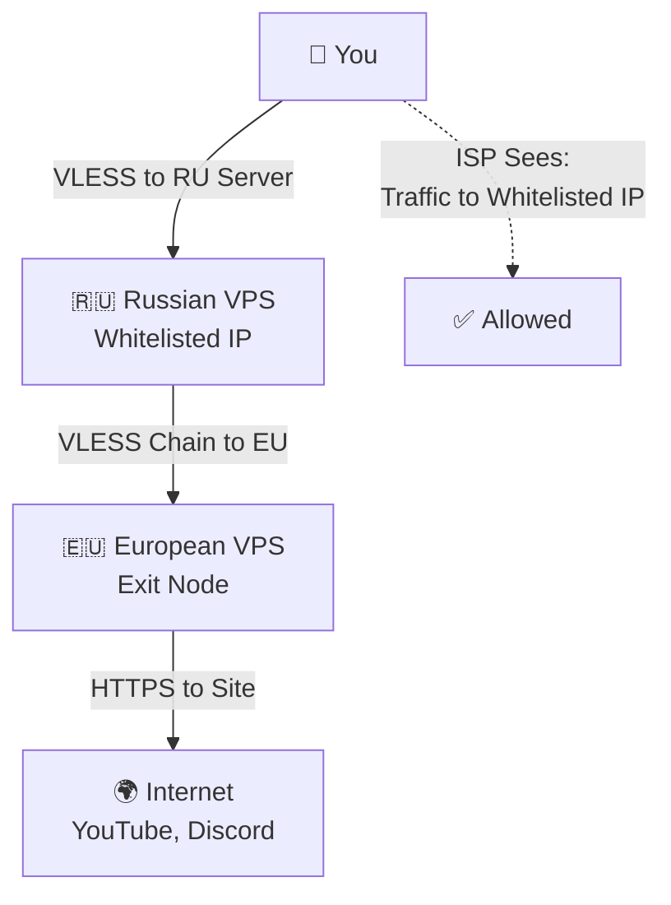

# 🚀 Bypassing Whitelists: Chain Through Russian Server

## 📐 How This Method Works



**In Simple Terms:**
1. You connect to a Russian server
2. The Russian server forwards traffic to a European server
3. The European server accesses websites
4. Your ISP only sees connection to the Russian server

---

## ⚠️ What You Need Before Starting

This method requires:

| What | Why | Approximate Cost |
|------|-----|------------------|
| **Russian VPS** | Server in Russia with whitelisted IP | 200-500₽/month |
| **European VPS** | Server in Europe for internet exit | 300-600₽/month |
| **Domain** | For nice server addresses | 100-500₽/year |

**Total**: about 600-1200₽ per month

---

## 📦 Step 1: Renting a Russian Server

### Where to Rent

You need a server in Russia with a **whitelisted IP address**. Here are verified options:

| Hosting | Link | Price | Note |
|---------|------|------|------|
| **Yandex Cloud** | [cloud.yandex.ru](https://cloud.yandex.ru/) | from 200₽/month | IP always in whitelist |
| **Timeweb** | [timeweb.ru](https://timeweb.ru/) | from 300₽/month | Reliable hosting, whitelisted IP |
| **Selectel** | [selectel.ru](https://selectel.ru/) | from 350₽/month | Whitelisted IP |
| **Hostkey** | [hostkey.ru](https://hostkey.ru/) | from 490₽/month | Some IPs in whitelist |

> [!NOTE]
> **VK Cloud** also works, but prices start from 2100₽/month — too expensive for personal use.

### How to Check if IP is Whitelisted

Before purchasing, обязательно check the IP address:

1. After renting the server, open the hosting panel
2. Copy the IP address (e.g., `185.123.45.67`)
3. Open browser on your phone **without VPN** (MTS/MegaFon/Beeline)
4. Enter in address bar: `https://185.123.45.67`
5. If page loads (even with security error) — **IP is in whitelist** ✅

### What to Choose When Ordering

When renting a server, specify:

- **Location**: Moscow, St. Petersburg or any city in Russia
- **Operating System**: Ubuntu Server 22.04 or Ubuntu Server 24.04
- **RAM**: 1-2 GB
- **CPU**: 1 core
- **Disk**: 10-20 GB

After payment, you'll receive via email:
- Server IP address
- Login (usually `root`)
- Password or SSH-key instructions

---

## 🌐 Step 2: Buying a Domain

Domain is needed to access servers by name, not by IP address.

### Where to Buy Domain

| Registrar | Link | Price per Year |
|-----------|------|----------------|
| **Cloudflare** | [cloudflare.com](https://cloudflare.com/) | from $10 |
| **Namecheap** | [namecheap.com](https://namecheap.com/) | from $8 |

### Which Domain to Choose

For personal project, cheap zones work well:

- `.xyz` — from 100₽/year
- `.site` — from 150₽/year
- `.online` — from 200₽/year
- `.li` — from 300₽/year

**Example**: `myvpn.xyz` or `fastnet.site`

> [!TIP]
> Before buying, check that domain is not blocked in Russia. Open it in browser without VPN — if it loads, you're good.

---

## 🛠️ Step 3: DNS Configuration

DNS is a system that converts domain names to IP addresses.

### Registration on Cloudflare

1. Open [cloudflare.com](https://cloudflare.com/)
2. Click **Sign Up**
3. Enter email and create password
4. Confirm email

### Adding Domain

1. After login, click **Add a Site**
2. Enter your domain (e.g., `myvpn.xyz`)
3. Cloudflare will scan current DNS records
4. Choose Free plan
5. Cloudflare will show two NS server addresses

### Configuring DNS Servers

1. Go to registrar panel where you bought domain
2. Find **DNS** or **Domain Management** section
3. Find **DNS Servers** field
4. Replace old DNS servers with those shown by Cloudflare
5. Save changes

**Wait 5-10 minutes** for changes to take effect.

### Creating DNS Records

Now create two records so domain points to your servers.

**First Record (Russian Server):**

1. In Cloudflare, go to **DNS** section
2. Click **Add Record**
3. Fill fields:
   - **Type**: `A`
   - **Name**: `ru`
   - **IPv4 address**: `<IP of Russian VPS>` (e.g., `185.123.45.67`)
   - **Proxy status**: ❌ **DNS only** (grey cloud, NOT orange!)
4. Click **Save**

**Second Record (European Server):**

1. Click **Add Record** again
2. Fill fields:
   - **Type**: `A`
   - **Name**: `eu`
   - **IPv4 address**: `<IP of European VPS>` (e.g., `95.234.56.78`)
   - **Proxy status**: ❌ **DNS only** (grey cloud)
3. Click **Save**

Now you have two addresses:
- `ru.myvpn.xyz` → Russian VPS
- `eu.myvpn.xyz` → European VPS

---

## 🔧 Step 4: Configuring European Server

European server will be the exit point — traffic goes to internet through it.

### Connecting to Server

1. Open terminal on computer (Windows: PowerShell, macOS: Terminal, Linux: Terminal)
2. Enter command:

```bash
ssh root@<IP of European VPS>
```

3. Enter server password (symbols won't show — that's normal)

### Installing Xray

Xray is a program that creates VPN connection.

Enter command:

```bash
bash -c "$(curl -Ls [https://github.com/XTLS/Xray-install/raw/main/install-release.sh](https://github.com/XTLS/Xray-install/raw/main/install-release.sh))" @ install
```

Wait for installation to complete.

### Generating UUID

UUID is a unique key for connection.

Enter command:

```bash
xray uuid
```

You'll see something like:

a1b2c3d4-e5f6-7890-abcd-ef1234567890

text


**Copy this UUID** and save in notepad — you'll need it later.

### Creating Config

Now create configuration file.

Enter commands one by one:

```bash
export DOMAIN=eu.myvpn.xyz
export UUID=a1b2c3d4-e5f6-7890-abcd-ef1234567890
export EMAIL=youremail@example.com
```

**Replace:**
- `myvpn.xyz` with your domain
- `UUID` with yours from previous step
- `youremail@example.com` with your email

Get SSL certificate:

```bash
systemctl stop nginx
xray tls cert --domain $DOMAIN --email $EMAIL
```

Create config:

```bash
cat > /etc/xray/config.json << 'EOF'
{
  "inbounds": [{
    "port": 443,
    "protocol": "vless",
    "settings": {
      "clients": [{"id": "UUID", "level": 0, "encryption": "none"}],
      "decryption": "none"
    },
    "streamSettings": {
      "network": "tcp",
      "security": "reality",
      "realitySettings": {
        "show": false,
        "dest": "microsoft.com:443",
        "serverNames": ["microsoft.com"],
        "privateKey": "PRIVATE_KEY",
        "shortIds": [""]
      }
    }
  }],
  "outbounds": [{"protocol": "freedom"}]
}
EOF
```

**Important:** Replace `UUID` with yours in this config!

Open config file:

```bash
nano /etc/xray/config.json
```

Find line `"id": "UUID"` and replace `UUID` with yours.

Save in nano:
1. Press `Ctrl + O`
2. Press `Enter`
3. Press `Ctrl + X`

Restart Xray:

```bash
systemctl restart xray
systemctl enable xray
```

Check that it works:

```bash
systemctl status xray
```

Should show `active (running)`.

---

## 🌉 Step 5: Configuring Russian Server

Russian server will receive traffic from you and forward to European server.

### Connecting to Server

In new terminal window, connect to Russian server:

```bash
ssh root@<IP of Russian VPS>
```

### Installing Xray

```bash
bash -c "$(curl -Ls [https://github.com/XTLS/Xray-install/raw/main/install-release.sh](https://github.com/XTLS/Xray-install/raw/main/install-release.sh))" @ install
```

### Creating Config

Enter commands:

```bash
export DOMAIN=ru.myvpn.xyz
export RELAY_DOMAIN=eu.myvpn.xyz
export UUID=a1b2c3d4-e5f6-7890-abcd-ef1234567890
export EMAIL=youremail@example.com
```

**Replace:**
- `myvpn.xyz` with your domain
- `UUID` with same one you used on European server
- `youremail@example.com` with your email

Get SSL certificate:

```bash
systemctl stop nginx
xray tls cert --domain $DOMAIN --email $EMAIL
```

Create config:

```bash
cat > /etc/xray/config.json << 'EOF'
{
  "inbounds": [{
    "port": 443,
    "protocol": "vless",
    "settings": {
      "clients": [{"id": "UUID", "level": 0, "encryption": "none"}],
      "decryption": "none"
    },
    "streamSettings": {
      "network": "tcp",
      "security": "reality",
      "realitySettings": {
        "show": false,
        "dest": "microsoft.com:443",
        "serverNames": ["microsoft.com"],
        "privateKey": "PRIVATE_KEY",
        "shortIds": [""]
      }
    }
  }],
  "outbounds": [{
    "protocol": "vless",
    "settings": {
      "vnext": [{
        "address": "eu.myvpn.xyz",
        "port": 443,
        "users": [{"id": "UUID", "encryption": "none"}]
      }]
    },
    "streamSettings": {
      "network": "tcp",
      "security": "tls",
      "tlsSettings": {
        "serverName": "eu.myvpn.xyz"
      }
    }
  }]
}
EOF
```

**Important:** Replace `UUID` with yours!

Open and edit:

```bash
nano /etc/xray/config.json
```

Replace both `UUID` with yours, save (`Ctrl + O`, `Enter`, `Ctrl + X`).

Restart:

```bash
systemctl restart xray
systemctl enable xray
```

Check:

```bash
systemctl status xray
```

---

## 📱 Step 6: Client Configuration

Now configure app on phone or computer.

### Which Apps to Use

| Device | App | Link |
|--------|-----|------|
| **Android** | Hiddify | [GitHub](https://github.com/hiddify/hiddify-next/releases) |
| **Android** | NekoBox | [GitHub](https://github.com/MatsuriDayo/NekoBoxForAndroid/releases) |
| **iOS** | FoXray | [App Store](https://apps.apple.com/app/foxray/id6449589423) |
| **Windows** | Hiddify | [GitHub](https://github.com/hiddify/hiddify-next/releases) |
| **Windows** | NekoRay | [GitHub](https://github.com/MatsuriDayo/nekoray/releases) |

### Creating Connection

1. Download and install app
2. Open app
3. Click **Add Profile** or **Import Config**
4. Choose **Manual**

Fill fields:

| Field | What to Enter |
|-------|---------------|
| **Protocol** | `VLESS` |
| **Address** | `ru.myvpn.xyz` (your domain) |
| **Port** | `443` |
| **UUID** | The UUID you generated on European server |
| **Network** | `TCP` |
| **Security** | `Reality` |
| **SNI** | `microsoft.com` |
| **Fingerprint** | `chrome` |
| **ALPN** | `h2` |

Save and press **Connect**.

---

## ✅ Step 7: Testing

1. **Turn off Wi-Fi** on phone, leave only mobile internet (MTS/MegaFon/Beeline)
2. **Enable VPN** in app
3. **Open site** [2ip.ru](https://2ip.ru)
4. Site should show **IP address of European server** (not home IP and not Russian server IP)

If you see European server IP — it works! ✅

### Speed Test

1. Open [speedtest.net](https://speedtest.net)
2. Press **Go**
3. Should get **50-100 Mbps**

---

## 💰 Cost Breakdown

| What | Price per Month |
|------|-----------------|
| Russian VPS | 200-500₽ |
| European VPS | 300-600₽ |
| Domain | ~50₽ (500₽/year) |
| **Total** | **~550-1150₽** |

---

## ⚠️ Troubleshooting

### Russian Server IP Not in Whitelist

If page didn't load during check (Step 1):

- Try different hosting (Yandex Cloud, Timeweb, Selectel)
- Make sure you're using mobile internet (MTS/MegaFon/Beeline), not Wi-Fi

### VPN Not Connecting

Check:

1. DNS records in Cloudflare (correct IPs)
2. Xray on both servers: `systemctl status xray`
3. Port 443 open on both servers

### Slow Speed

- Check speed between servers
- Try different port (not 443)

---

## 📚 Useful Links

- **Yandex Cloud**: [cloud.yandex.ru](https://cloud.yandex.ru/)
- **Timeweb**: [timeweb.ru](https://timeweb.ru/)
- **Selectel**: [selectel.ru](https://selectel.ru/)
- **Cloudflare**: [cloudflare.com](https://cloudflare.com/)
- **Xray**: [github.com/XTLS/Xray-core](https://github.com/XTLS/Xray-core)
- **Hiddify**: [github.com/hiddify/hiddify-next](https://github.com/hiddify/hiddify-next)

---

> [!NOTE]
> If this method doesn't work with your ISP, try other methods from `guide/` section.
