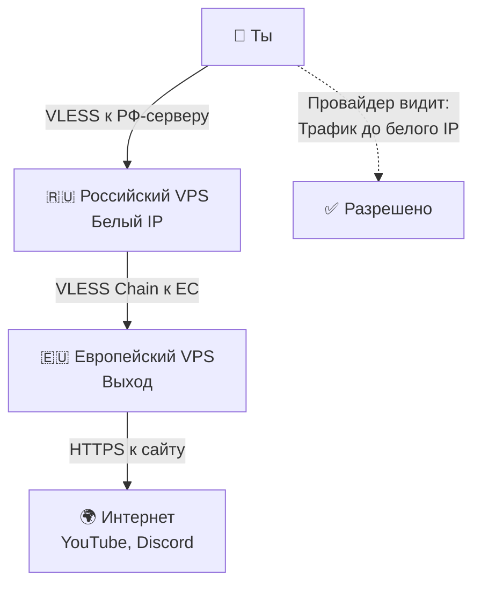

# 🚀 Обход белых списков: Цепочка через российский сервер

## 📐 Как работает этот способ



**Простыми словами:**
1. Ты подключаешься к российскому серверу
2. Российский сервер пересылает трафик на европейский
3. Европейский сервер открывает сайты
4. Твой провайдер видит только подключение к российскому серверу

---

## ⚠️ Что нужно перед началом

Для этого способа понадобятся:

| Что | Зачем | Примерная цена |
|-----|-------|----------------|
| **Российский VPS** | Сервер в России с белым IP | 200-500₽/месяц |
| **Европейский VPS** | Сервер в Европе для выхода в интернет | 300-600₽/месяц |
| **Домен** | Для красивых адресов серверов | 100-500₽/год |

**Всего**: около 600-1200₽ в месяц

---

## 📦 Шаг 1: Аренда российского сервера

### Где арендовать

Тебе нужен сервер в России с **белым IP-адресом**. Вот проверенные варианты:

| Хостинг | Ссылка | Цена | Примечание |
|---------|--------|------|------------|
| **Яндекс Cloud** | [cloud.yandex.ru](https://cloud.yandex.ru/) | от 200₽/мес | IP всегда в белом списке |
| **Timeweb** | [timeweb.ru](https://timeweb.ru/) | от 300₽/мес | Надёжный хостинг, белый IP |
| **Selectel** | [selectel.ru](https://selectel.ru/) | от 350₽/мес | Белый IP |
| **Hostkey** | [hostkey.ru](https://hostkey.ru/) | от 490₽/мес | Некоторые IP в белом списке |

> [!NOTE]
> **VK Cloud** тоже подходит, но цены от 2100₽/мес — дорого для личного использования.

### Как проверить, что IP в белом списке

Перед покупкой обязательно проверь IP-адрес:

1. После аренды сервера открой панель хостинга
2. Скопируй IP-адрес (например, `185.123.45.67`)
3. Открой браузер на телефоне **без VPN** (МТС/Мегафон/Билайн)
4. Введи в адресную строку: `https://185.123.45.67`
5. Если страница загрузилась (даже с ошибкой безопасности) — **IP в белом списке** ✅

### Что выбрать при заказе

При аренде сервера укажи:

- **Локация**: Москва, Санкт-Петербург или любой город в России
- **Операционная система**: Ubuntu Server 22.04 или Ubuntu Server 24.04
- **Оперативная память**: 1-2 ГБ
- **Процессор**: 1 ядро
- **Диск**: 10-20 ГБ

После оплаты тебе на почту придут:
- IP-адрес сервера
- Логин (обычно `root`)
- Пароль или инструкция по SSH-ключу

---

## 🌐 Шаг 2: Покупка домена

Домен нужен для того, чтобы обращаться к серверам по имени, а не по IP-адресу.

### Где купить домен

| Регистратор | Ссылка | Цена в год |
|-------------|--------|------------|
| **Cloudflare** | [cloudflare.com](https://cloudflare.com/) | от $10 |
| **Namecheap** | [namecheap.com](https://namecheap.com/) | от $8 |

### Какой домен выбрать

Для личного проекта подойдут недорогие зоны:

- `.xyz` — от 100₽/год
- `.site` — от 150₽/год
- `.online` — от 200₽/год
- `.li` — от 300₽/год

**Пример**: `myvpn.xyz` или `fastnet.site`

> [!TIP]
> Перед покупкой проверь, что домен не заблокирован в России. Открой его в браузере без VPN — если загружается, всё в порядке.

---

## 🛠️ Шаг 3: Настройка DNS

DNS — это система, которая превращает имена доменов в IP-адреса.

### Регистрация на Cloudflare

1. Открой сайт [cloudflare.com](https://cloudflare.com/)
2. Нажми **Sign Up** (Зарегистрироваться)
3. Введи email и придумай пароль
4. Подтверди email

### Добавление домена

1. После входа нажми **Add a Site** (Добавить сайт)
2. Введи свой домен (например, `myvpn.xyz`)
3. Cloudflare просканирует текущие DNS-записи
4. Выбери бесплатный план (Free)
5. Cloudflare покажет два адреса NS-серверов

### Настройка NS-серверов

1. Зайди в панель регистратора, где покупал домен
2. Найди раздел **DNS** или **Управление доменом**
3. Найди поле **DNS-серверы**
4. Замени старые DNS-серверы на те, что показал Cloudflare
5. Сохрани изменения

**Подожди 5-10 минут**, пока изменения вступят в силу.

### Создание DNS-записей

Теперь нужно создать две записи, чтобы домен указывал на твои серверы.

**Первая запись (российский сервер):**

1. В Cloudflare перейди в раздел **DNS**
2. Нажми **Add Record** (Добавить запись)
3. Заполни поля:
   - **Type**: `A`
   - **Name**: `ru`
   - **IPv4 address**: `<IP российского VPS>` (например, `185.123.45.67`)
   - **Proxy status**: ❌ **DNS only** (серое облако, НЕ оранжевое!)
4. Нажми **Save**

**Вторая запись (европейский сервер):**

1. Снова нажми **Add Record**
2. Заполни поля:
   - **Type**: `A`
   - **Name**: `eu`
   - **IPv4 address**: `<IP европейского VPS>` (например, `95.234.56.78`)
   - **Proxy status**: ❌ **DNS only** (серое облако)
3. Нажми **Save**

Теперь у тебя есть два адреса:
- `ru.myvpn.xyz` → российский VPS
- `eu.myvpn.xyz` → европейский VPS

---

## 🔧 Шаг 4: Настройка европейского сервера

Европейский сервер будет конечной точкой — через него трафик выходит в интернет.

### Подключение к серверу

1. Открой терминал на компьютере (Windows: PowerShell, macOS: Terminal, Linux: Terminal)
2. Введи команду:

```bash
ssh root@<IP европейского VPS>
```

3. Введи пароль от сервера (символы не будут отображаться — это нормально)

### Установка Xray

Xray — это программа, которая создаёт VPN-подключение.

Введи команду:

```bash
bash -c "$(curl -Ls [https://github.com/XTLS/Xray-install/raw/main/install-release.sh](https://github.com/XTLS/Xray-install/raw/main/install-release.sh))" @ install
```

Дождись окончания установки.

### Генерация UUID

UUID — это уникальный ключ для подключения.

Введи команду:

```bash
xray uuid
```

Ты увидишь что-то вроде:

a1b2c3d4-e5f6-7890-abcd-ef1234567890

text


**Скопируй этот UUID** и сохрани в блокноте — он понадобится позже.

### Создание конфига

Теперь нужно создать файл конфигурации.

Введи команды по очереди:

```bash
export DOMAIN=eu.myvpn.xyz
export UUID=a1b2c3d4-e5f6-7890-abcd-ef1234567890
export EMAIL=tvoya@pochta.com
```

**Замени:**
- `myvpn.xyz` на свой домен
- `UUID` на свой из предыдущего шага
- `tvoya@pochta.com` на свою почту

Получи SSL-сертификат:

```bash
systemctl stop nginx
xray tls cert --domain $DOMAIN --email $EMAIL
```

Создай конфиг:

```bash
cat > /etc/xray/config.json << 'EOF'
{
  "inbounds": [{
    "port": 443,
    "protocol": "vless",
    "settings": {
      "clients": [{"id": "UUID", "level": 0, "encryption": "none"}],
      "decryption": "none"
    },
    "streamSettings": {
      "network": "tcp",
      "security": "reality",
      "realitySettings": {
        "show": false,
        "dest": "microsoft.com:443",
        "serverNames": ["microsoft.com"],
        "privateKey": "PRIVATE_KEY",
        "shortIds": [""]
      }
    }
  }],
  "outbounds": [{"protocol": "freedom"}]
}
EOF
```

**Важно:** В этом конфиге нужно заменить `UUID` на свой!

Открой файл конфига:

```bash
nano /etc/xray/config.json
```

Найди строчку `"id": "UUID"` и замени `UUID` на свой.

Сохранить в nano:
1. Нажми `Ctrl + O`
2. Нажми `Enter`
3. Нажми `Ctrl + X`

Перезапусти Xray:

```bash
systemctl restart xray
systemctl enable xray
```

Проверь, что всё работает:

```bash
systemctl status xray
```

Должно быть написано `active (running)`.

---

## 🌉 Шаг 5: Настройка российского сервера

Российский сервер будет принимать трафик от тебя и пересылать на европейский.

### Подключение к серверу

В новом окне терминала подключись к российскому серверу:

```bash
ssh root@<IP российского VPS>
```

### Установка Xray

```bash
bash -c "$(curl -Ls [https://github.com/XTLS/Xray-install/raw/main/install-release.sh](https://github.com/XTLS/Xray-install/raw/main/install-release.sh))" @ install
```

### Создание конфига

Введи команды:

```bash
export DOMAIN=ru.myvpn.xyz
export RELAY_DOMAIN=eu.myvpn.xyz
export UUID=a1b2c3d4-e5f6-7890-abcd-ef1234567890
export EMAIL=tvoya@pochta.com
```

**Замени:**
- `myvpn.xyz` на свой домен
- `UUID` на тот же, что использовал на европейском сервере
- `tvoya@pochta.com` на свою почту

Получи SSL-сертификат:

```bash
systemctl stop nginx
xray tls cert --domain $DOMAIN --email $EMAIL
```

Создай конфиг:

```bash
cat > /etc/xray/config.json << 'EOF'
{
  "inbounds": [{
    "port": 443,
    "protocol": "vless",
    "settings": {
      "clients": [{"id": "UUID", "level": 0, "encryption": "none"}],
      "decryption": "none"
    },
    "streamSettings": {
      "network": "tcp",
      "security": "reality",
      "realitySettings": {
        "show": false,
        "dest": "microsoft.com:443",
        "serverNames": ["microsoft.com"],
        "privateKey": "PRIVATE_KEY",
        "shortIds": [""]
      }
    }
  }],
  "outbounds": [{
    "protocol": "vless",
    "settings": {
      "vnext": [{
        "address": "eu.myvpn.xyz",
        "port": 443,
        "users": [{"id": "UUID", "encryption": "none"}]
      }]
    },
    "streamSettings": {
      "network": "tcp",
      "security": "tls",
      "tlsSettings": {
        "serverName": "eu.myvpn.xyz"
      }
    }
  }]
}
EOF
```

**Важно:** Замени `UUID` на свой!

Открой и отредактируй:

```bash
nano /etc/xray/config.json
```

Замени оба `UUID` на свой, сохрани (`Ctrl + O`, `Enter`, `Ctrl + X`).

Перезапусти:

```bash
systemctl restart xray
systemctl enable xray
```

Проверь:

```bash
systemctl status xray
```

---

## 📱 Шаг 6: Подключение клиента

Теперь нужно настроить приложение на телефоне или компьютере.

### Какие приложения использовать

| Устройство | Приложение | Ссылка |
|------------|------------|--------|
| **Android** | Hiddify | [GitHub](https://github.com/hiddify/hiddify-next/releases) |
| **Android** | NekoBox | [GitHub](https://github.com/MatsuriDayo/NekoBoxForAndroid/releases) |
| **iOS** | FoXray | [App Store](https://apps.apple.com/app/foxray/id6449589423) |
| **Windows** | Hiddify | [GitHub](https://github.com/hiddify/hiddify-next/releases) |
| **Windows** | NekoRay | [GitHub](https://github.com/MatsuriDayo/nekoray/releases) |

### Создание подключения

1. Скачай и установи приложение
2. Открой приложение
3. Нажми **Добавить профиль** или **Import Config**
4. Выбери **Manual** (Вручную)

Заполни поля:

| Поле | Что писать |
|------|------------|
| **Protocol** | `VLESS` |
| **Address** | `ru.myvpn.xyz` (твой домен) |
| **Port** | `443` |
| **UUID** | Тот UUID, что генерировал на европейском сервере |
| **Network** | `TCP` |
| **Security** | `Reality` |
| **SNI** | `microsoft.com` |
| **Fingerprint** | `chrome` |
| **ALPN** | `h2` |

Сохранить и нажать **Connect** (Подключиться).

---

## ✅ Шаг 7: Проверка работы

1. **Отключи Wi-Fi** на телефоне, оставь только мобильный интернет (МТС/Мегафон/Билайн)
2. **Включи VPN** в приложении
3. **Открой сайт** [2ip.ru](https://2ip.ru)
4. Сайт должен показать **IP-адрес европейского сервера** (не домашний и не российский)

Если IP европейского сервера — всё работает! ✅

### Проверка скорости

1. Открой [speedtest.net](https://speedtest.net)
2. Нажми **Go**
3. Должно быть **50-100 Mbps**

---

## 💰 Сколько это стоит

| Что | Цена в месяц |
|-----|--------------|
| Российский VPS | 200-500₽ |
| Европейский VPS | 300-600₽ |
| Домен | ~50₽ (500₽ в год) |
| **Всего** | **~550-1150₽** |

---

## ⚠️ Если что-то не работает

### IP российского сервера не в белом списке

Если при проверке (Шаг 1) страница не загрузилась:

- Попробуй другой хостинг (Яндекс Cloud, Timeweb, Selectel)
- Убедись, что используешь мобильный интернет (МТС/Мегафон/Билайн), а не Wi-Fi

### Не подключается VPN

Проверь:

1. DNS-записи в Cloudflare (правильные ли IP)
2. Xray на обоих серверах: `systemctl status xray`
3. Порт 443 открыт на обоих серверах

### Медленная скорость

- Проверь скорость между серверами
- Попробуй другой порт (не 443)

---

## 📚 Полезные ссылки

- **Яндекс Cloud**: [cloud.yandex.ru](https://cloud.yandex.ru/)
- **Timeweb**: [timeweb.ru](https://timeweb.ru/)
- **Selectel**: [selectel.ru](https://selectel.ru/)
- **Cloudflare**: [cloudflare.com](https://cloudflare.com/)
- **Xray**: [github.com/XTLS/Xray-core](https://github.com/XTLS/Xray-core)
- **Hiddify**: [github.com/hiddify/hiddify-next](https://github.com/hiddify/hiddify-next)

---

> [!NOTE]
> Если этот способ не работает у твоего оператора, попробуй другие методы из раздела `guide/`.
